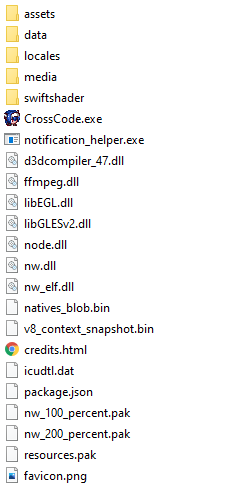

# Finding the CrossCode installation folder

| :warning: Due to DRM it is not possible to mod XBox Game Pass or Microsoft Store versions of the game. |
|---|

The installation folder is contains these files:

## Steam

In order to open the installation folder through Steam you can follow these steps:

1. Go to the Steam library
2. On the left side, right click on CrossCode
3. Click on `Properties`
4. Choose the `Local Files` tab
5. Click `Browse Local Files...` and the folder should open

### Video

