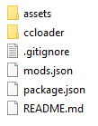

#  Installing the modloader (CCLoader)

| :warning: Due to DRM it is not possible to mod XBox Game Pass or Microsoft Store versions of the game. |
|---|

## Requirements

* [Finding the CrossCode installation folder](./findingCrossCode.md)
* [CCLoader](https://github.com/CCDirectLink/CCLoader/releases/latest) (Download `Source code (zip)`)

## Steps

1. Open the downloaded zip
2. Open the folder inside the zip so that you can see the `package.json` file:

3. Extract/drag all these files into the [CrossCode installation folder](./findingCrossCode.md)
4. Should you be asked to override files, choose `yes`