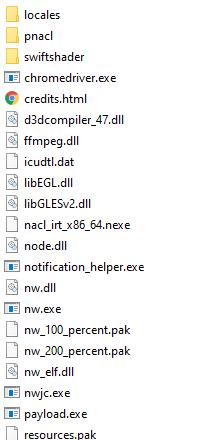

# Installing the Developer Tools (NW.js SDK)

## Requirements

* [Finding the CrossCode installation folder](./findingCrossCode.md)
* [NW.js SDK](https://nwjs.io/) (Download `SDK`)

| :warning: The game uses an outdated version of NW.js so you might want to use the version [0.35.5](https://dl.nwjs.io/v0.35.5/nwjs-sdk-v0.35.5-win-x64.zip) to avoid accidentally using features not yet available in CrossCode.|
|---|

## Steps

1. Open the nwjs-sdk zip
2. Open the folder so that you can see the `nw.exe` file:

3. Extract/drag all files into [the CrossCode installation folder](./findingCrossCode.md) (replace existing files)
4. Delete `CrossCode.exe`
5. Rename `nw.exe` to `CrossCode.exe`
6. Open the game
7. Press F12 to open the DevTools
8. Choose the `Console` tab
9. In the top bar, click `top`
10. Choose the second entry of the dropdown list
11. You can now enter commands into the white area below
