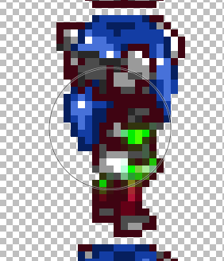
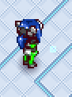

# Making a mod

## Requirements

* [Installing CCLoader](./installingCCLoader.md)
* [Finding the CrossCode installation folder](./findingCrossCode.md)

## Steps

1. Open [the CrossCode installation folder](./findingCrossCode.md)
2. Open `assets` -> `mods`
3. Create a new folder for your mod. In this example we are going to use `myMod`
4. Create a new file called `ccmod.json`

This file is used to tell CCLoader how to load your mod.  
It contains information about the mod title, version, description, etc...  
Read [the `ccmod.json` standard](https://github.com/CCDirectLink/CCModDB/blob/master/CCMOD-STANDARD.md) to learn how to create your own `ccmod.json`.  
Only `id` and `version` are required to just load the mod, but if if you want to publish it to the centralized mod database, you need to follow the standard mentioned above.

5. Find a file to modify

In this example we will do a simple palette swap of Lea. You can find her sprites in `assets/media/entity/player/move.png`.

6. Copy the file to your mod

In order for CCLoader to pick up the file from the mod it needs to be inside the mod folder with the same name as the original. This means that `assets/media/entity/player/move.png` turns into `assets/mods/myMod/assets/media/entity/player/move.png`.

| :warning: Do not publish original CrossCode files in your mod |
|---|

7. Edit the file

In this example I am using Paint.net to swap Lea's red clothes for green ones:

8. Restart the game and test your mod

